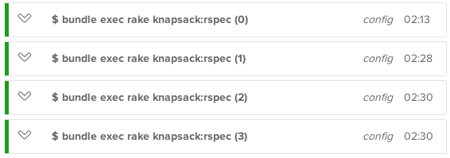

> [!WARNING]
> Knapsack is [archived](https://knapsackpro.com/knapsack_gem?utm_source=github&utm_medium=readme&utm_campaign=knapsack_gem_archived&utm_content=warning_knapsack_gem). But [Knapsack Pro](https://knapsackpro.com?utm_source=github&utm_medium=readme&utm_campaign=knapsack_gem_archived&utm_content=warning_knapsack_pro) is available.
>
> Knapsack Pro comes with a free plan and discounts on paid plans for people coming from Knapsack.
>
> This repository remains available to fork and the gem hosted on RubyGems, so your existing setup won't be affected.

<p align="center">
  <a href="https://knapsackpro.com?utm_source=github&utm_medium=readme&utm_campaign=knapsack_gem_archived&utm_content=hero_logo">
    
  </a>
</p>

<h3 align="center">Speed up your tests</h3>
<p align="center">Run your 1-hour test suite in 2 minutes with optimal parallelisation on your existing CI infrastructure</p>

---

<div align="center">
  <a href="https://rubygems.org/gems/knapsack">
    
  </a>
</div>

<br />
<br />

Knapsack wraps your current test runner and works with your existing CI infrastructure to split tests optimally.

It comes in two flavors, `knapsack` and `knapsack_pro`:

|                                 | `knapsack` | `knapsack_pro`                          |
| ------------------------------- | ---------- | --------------------------------------- |
| Free                            | ✅         | ✅ [Free plan](https://knapsackpro.com?utm_source=github&utm_medium=readme&utm_campaign=knapsack_gem_archived&utm_content=free_plan) |
| Static split                    | ✅         | ✅                                      |
| [Dynamic split](https://docs.knapsackpro.com/overview/#queue-mode-dynamic-split)       | ❌ | ✅ |
| [Split by test examples](https://docs.knapsackpro.com/ruby/split-by-test-examples/)    | ❌ | ✅ |
| Graphs, metrics, and stats      | ❌         | ✅                                      |
| Programming languages           | 🤞 (Ruby)  | ✅ (Ruby, Cypress, Jest, SDK/API)       |
| CI providers                    | 🤞 Limited | ✅ (All)                                |
| [Heroku add-on](https://elements.heroku.com/addons/knapsack-pro)                       | ❌ | ✅ |
| Automated execution time recording                                                     | ❌ | ✅ |
| Test split based on most recent execution times                                        | ❌ | ✅ |
| Support for spot/preemptible CI nodes                                                   | ❌ | ✅ |
| Additional features             | ❌         | 🤘 ([Overview](https://docs.knapsackpro.com/overview/)) |
|                                 | [Install](#knapsack) | [Install](https://docs.knapsackpro.com) |

## Migrate from `knapsack` to `knapsack_pro`

If you already use `knapsack` and want to give `knapsack_pro` a try, here's [how to migrate in 10 minutes](./MIGRATE_TO_KNAPSACK_PRO.md).

## `knapsack`

Knapsack generates a test time execution report and uses it for future test runs.

The `knapsack` gem supports:

* [RSpec](http://rspec.info)
* [Cucumber](https://cucumber.io)
* [Minitest](http://docs.seattlerb.org/minitest/)
* [Spinach](https://github.com/codegram/spinach)
* [Turnip](https://github.com/jnicklas/turnip)

### Without Knapsack - bad test suite split


### With Knapsack - better test suite split



### Requirements

`>= Ruby 2.1.0`

---

<!-- START doctoc generated TOC please keep comment here to allow auto update -->
<!-- DON'T EDIT THIS SECTION, INSTEAD RE-RUN doctoc TO UPDATE -->

- [Update](#update)
- [Installation](#installation)
- [Usage](#usage)
  - [Step for RSpec](#step-for-rspec)
  - [Step for Cucumber](#step-for-cucumber)
  - [Step for Minitest](#step-for-minitest)
  - [Step for Spinach](#step-for-spinach)
  - [Custom configuration](#custom-configuration)
  - [Common step](#common-step)
    - [Adding or removing tests](#adding-or-removing-tests)
- [Set up your CI server](#set-up-your-ci-server)
  - [Info about ENV variables](#info-about-env-variables)
  - [Passing arguments to the Rake task](#passing-arguments-to-the-rake-task)
    - [Passing arguments to RSpec](#passing-arguments-to-rspec)
    - [Passing arguments to Cucumber](#passing-arguments-to-cucumber)
    - [Passing arguments to Minitest](#passing-arguments-to-minitest)
    - [Passing arguments to Spinach](#passing-arguments-to-spinach)
  - [Knapsack binary](#knapsack-binary)
  - [CircleCI](#circleci)
    - [Step 1](#step-1)
    - [Step 2](#step-2)
  - [Travis](#travis)
    - [Step 1](#step-1-1)
    - [Step 2](#step-2-1)
  - [Semaphore](#semaphore)
    - [Step 1](#step-1-2)
    - [Step 2](#step-2-2)
      - [Semaphore 2.0](#semaphore-20)
  - [Buildkite](#buildkite)
    - [Step 1](#step-1-3)
    - [Step 2](#step-2-3)
  - [GitLab CI](#gitlab-ci)
    - [Step 1](#step-1-4)
    - [Step 2](#step-2-4)
  - [Info for Jenkins](#info-for-jenkins)
  - [Info for BitBucket Pipelines](#info-for-bitbucket-pipelines)
    - [Step 1](#step-1-5)
    - [Step 2](#step-2-5)
- [FAQ](#faq)
  - [What does time offset warning mean?](#what-does-time-offset-warning-mean)
  - [How to generate the Knapsack report?](#how-to-generate-the-knapsack-report)
  - [What does "leftover specs" mean?](#what-does-leftover-specs-mean)
  - [Why are there "leftover specs" after I generate a new report?](#why-are-there-leftover-specs-after-i-generate-a-new-report)
  - [How can I run tests from multiple directories?](#how-can-i-run-tests-from-multiple-directories)
  - [How to update the existing Knapsack report for a few test files?](#how-to-update-the-existing-knapsack-report-for-a-few-test-files)
  - [How to run tests for particular CI node in your development environment](#how-to-run-tests-for-particular-ci-node-in-your-development-environment)
  - [How can I change the log level?](#how-can-i-change-the-log-level)
- [Gem tests](#gem-tests)
  - [Spec](#spec)
  - [Spec examples](#spec-examples)
- [Acknowledgements](#acknowledgements)
- [Mentions](#mentions)

<!-- END doctoc generated TOC please keep comment here to allow auto update -->


## Update

Please check [CHANGELOG.md](./CHANGELOG.md) before updating the gem. Knapsack follows [semantic versioning](http://semver.org).

## Installation

Add these lines to your application's Gemfile:

```ruby
group :test, :development do
  gem 'knapsack'
end
```

And then execute:

```sh
bundle
```

Add this line at the bottom of `Rakefile`:

```ruby
Knapsack.load_tasks if defined?(Knapsack)
```

## Usage

Here's an example of a Rails app with Knapsack.

[https://github.com/KnapsackPro/rails-app-with-knapsack](https://github.com/KnapsackPro/rails-app-with-knapsack)

### Step for RSpec

Add at the beginning of your `spec_helper.rb`:

```ruby
require 'knapsack'

# CUSTOM_CONFIG_GOES_HERE

Knapsack::Adapters::RSpecAdapter.bind
```

### Step for Cucumber

Create `features/support/knapsack.rb`:

```ruby
require 'knapsack'

# CUSTOM_CONFIG_GOES_HERE

Knapsack::Adapters::CucumberAdapter.bind
```

### Step for Minitest

Add the Knapsack code after you load the app environment in `test/test_helper.rb`:

```ruby
ENV['RAILS_ENV'] ||= 'test'
require File.expand_path('../../config/environment', __FILE__)
require 'rails/test_help'

require 'knapsack'

# CUSTOM_CONFIG_GOES_HERE

knapsack_adapter = Knapsack::Adapters::MinitestAdapter.bind
knapsack_adapter.set_test_helper_path(__FILE__)
```

### Step for Spinach

Create `features/support/env.rb`:

```ruby
require 'knapsack'

# CUSTOM_CONFIG_GOES_HERE

Knapsack::Adapters::SpinachAdapter.bind
```

### Custom configuration

You can change the default Knapsack configuration for RSpec, Cucumber, Minitest, or Spinach tests.

Here are some examples (that you can insert in `CUSTOM_CONFIG_GOES_HERE`):

```ruby
Knapsack.tracker.config({
  enable_time_offset_warning: true,
  time_offset_in_seconds: 30
})

Knapsack.report.config({
  test_file_pattern: 'spec/**{,/*/**}/*_spec.rb', # default value based on adapter
  report_path: 'knapsack_custom_report.json'
})

# You can use your logger:
require 'logger'
Knapsack.logger = Logger.new(STDOUT)
Knapsack.logger.level = Logger::INFO
```

### Common step

Generate the time execution report for your test files. Run the command below on one of your CI nodes:

```sh
# Step for RSpec:
KNAPSACK_GENERATE_REPORT=true bundle exec rspec spec

# Step for Cucumber:
KNAPSACK_GENERATE_REPORT=true bundle exec cucumber features

# Step for Minitest:
KNAPSACK_GENERATE_REPORT=true bundle exec rake test

# If you use Rails 5.0.x then run this instead:
KNAPSACK_GENERATE_REPORT=true bundle exec rake test

# If you use Rails >= 5.1's SystemTest, run both unit and system tests:
KNAPSACK_GENERATE_REPORT=true bundle exec rake test test:system

# Step for Spinach:
KNAPSACK_GENERATE_REPORT=true bundle exec spinach
```

Commit the generated report `knapsack_rspec_report.json`, `knapsack_cucumber_report.json`, `knapsack_minitest_report.json` or `knapsack_spinach_report.json` into your repository.

This report should be updated after you add a lot of new slow tests or you change existing ones, which causes a big time execution difference between CI nodes.

You will get a time offset warning at the end of the RSpec/Cucumber/Minitest run, which reminds you when it’s a good time to regenerate the Knapsack report.

`KNAPSACK_GENERATE_REPORT` is truthy with `"true"` or `0`.  All other values are falsy, though [`"false"` and `1` are semantically preferrable](https://en.wikipedia.org/wiki/True_and_false_(commands)).

#### Adding or removing tests

There is no need to regenerate the report every time you add/remove test files.

If you remove a test file, Knapsack will ignore its entry in the report. If you add a new test file that is not listed in the report, the test file will be assigned to one of the CI nodes.

You'll want to regenerate your execution report whenever you remove or add a test file with a long time execution time that would affect one of the CI nodes. Knapsack warns you when it's a good time to regenerate the report.

## Set up your CI server

On your CI server, run the following command for the first CI node (increase `CI_NODE_INDEX` for the next nodes):

```sh
# Step for RSpec:
CI_NODE_TOTAL=2 CI_NODE_INDEX=0 bundle exec rake knapsack:rspec

# Step for Cucumber:
CI_NODE_TOTAL=2 CI_NODE_INDEX=0 bundle exec rake knapsack:cucumber

# Step for Minitest:
CI_NODE_TOTAL=2 CI_NODE_INDEX=0 bundle exec rake knapsack:minitest

# Step for Spinach:
CI_NODE_TOTAL=2 CI_NODE_INDEX=0 bundle exec rake knapsack:spinach
```

You can add `KNAPSACK_TEST_FILE_PATTERN` if your tests are not in the default directory:

```sh
# Step for RSpec:
KNAPSACK_TEST_FILE_PATTERN="directory_with_specs/**{,/*/**}/*_spec.rb" CI_NODE_TOTAL=2 CI_NODE_INDEX=0 bundle exec rake knapsack:rspec

# Step for Cucumber:
KNAPSACK_TEST_FILE_PATTERN="directory_with_features/**/*.feature" CI_NODE_TOTAL=2 CI_NODE_INDEX=0 bundle exec rake knapsack:cucumber

# Step for Minitest:
KNAPSACK_TEST_FILE_PATTERN="directory_with_tests/**{,/*/**}/*_spec.rb" CI_NODE_TOTAL=2 CI_NODE_INDEX=0 bundle exec rake knapsack:minitest

# Step for Spinach:
KNAPSACK_TEST_FILE_PATTERN="directory_with_features/**/*.feature" CI_NODE_TOTAL=2 CI_NODE_INDEX=0 bundle exec rake knapsack:spinach
```

You can set `KNAPSACK_REPORT_PATH` if your Knapsack report was saved in a non-default location:

```sh
# Step for RSpec:
KNAPSACK_REPORT_PATH="knapsack_custom_report.json" CI_NODE_TOTAL=2 CI_NODE_INDEX=0 bundle exec rake knapsack:rspec

# Step for Cucumber:
KNAPSACK_REPORT_PATH="knapsack_custom_report.json" CI_NODE_TOTAL=2 CI_NODE_INDEX=0 bundle exec rake knapsack:cucumber

# Step for Minitest:
KNAPSACK_REPORT_PATH="knapsack_custom_report.json" CI_NODE_TOTAL=2 CI_NODE_INDEX=0 bundle exec rake knapsack:minitest

# Step for Spinach:
KNAPSACK_REPORT_PATH="knapsack_custom_report.json" CI_NODE_TOTAL=2 CI_NODE_INDEX=0 bundle exec rake knapsack:spinach
```

### Info about ENV variables

`CI_NODE_TOTAL` - total number of CI nodes you have.

`CI_NODE_INDEX` - index of the current CI node starting from 0 (ie, the second CI node should have `CI_NODE_INDEX=1`).

Some CI providers like GitLab CI have the same name of environment variable like `CI_NODE_INDEX`, which starts from 1 instead of 0. Knapsack will automatically pick it up and change it from 1 to 0.

### Passing arguments to the Rake task

#### Passing arguments to RSpec

Knapsack allows you to pass arguments through to RSpec. For example, if you want to run only specs that have the tag `focus`. If you do this with RSpec directly, it would look like:

```sh
bundle exec rake rspec --tag focus
```

To do this with Knapsack, you simply add your RSpec arguments as parameters to the Knapsack Rake task:

```sh
bundle exec rake "knapsack:rspec[--tag focus]"
```

Remember that using tags to limit which specs get run will affect the time each file takes to run. One solution to this is to generate a new `knapsack_rspec_report.json` for the commonly run scenarios.

#### Passing arguments to Cucumber

```sh
bundle exec rake "knapsack:cucumber[--name feature]"
```

#### Passing arguments to Minitest

```sh
bundle exec rake "knapsack:minitest[--arg_name value]"
```

For instance, to run verbose tests:

```sh
bundle exec rake "knapsack:minitest[--verbose]"
```

#### Passing arguments to Spinach

```sh
bundle exec rake "knapsack:spinach[--name feature]"
```

### Knapsack binary

You can install `knapsack` globally and use the binary:

```sh
knapsack rspec "--tag custom_tag_name --profile"
knapsack cucumber
knapsack minitest "--verbose --pride"
knapsack spinach "-f spinach_examples"
```

Here's an [example](https://github.com/KnapsackPro/knapsack/pull/21) when it might be useful.

### CircleCI

If you are using circleci.com, you can omit `CI_NODE_TOTAL` and `CI_NODE_INDEX`. Knapsack will use the `CIRCLE_NODE_TOTAL` and `CIRCLE_NODE_INDEX` provided by CircleCI.

Here is an example for test configuration in your `.circleci/config.yml` file:

#### Step 1

Run all the tests on a single CI node with the enabled report generator:

```yaml
# CircleCI 2.0
- run:
  name: Step for RSpec
  command: |
    # export is important here
    export KNAPSACK_GENERATE_REPORT=true
    bundle exec rspec spec

- run:
  name: Step for Cucumber
  command: |
    # export is important here
    export KNAPSACK_GENERATE_REPORT=true
    bundle exec cucumber features

- run:
  name: Step for Minitest
  command: |
    # export is important here
    export KNAPSACK_GENERATE_REPORT=true
    bundle exec rake test
    # For Rails 5.1 runs unit and system tests
    bundle exec rake test test:system

- run:
  name: Step for Spinach
  command: |
    # export is important here
    export KNAPSACK_GENERATE_REPORT=true
    bundle exec rspec spinach
```

After the tests pass, you should copy the Knapsack JSON report and commit it into your repository as `knapsack_rspec_report.json`, `knapsack_cucumber_report.json`, `knapsack_minitest_report.json` or `knapsack_spinach_report.json`.

#### Step 2

Update the test command and enable parallelism (remember to add additional containers for your project in the CircleCI settings):

```yaml
# CircleCI 2.0
- run:
  name: Step for RSpec
  command: bundle exec rake knapsack:rspec

- run:
  name: Step for Cucumber
  command: bundle exec rake knapsack:cucumber

- run:
  name: Step for Minitest
  command: bundle exec rake knapsack:minitest

- run:
  name: Step for Spinach
  command: bundle exec rake knapsack:spinach
```

### Travis

#### Step 1

Run all the tests on a single CI node with the enabled report generator. Edit `.travis.yml`:

```yaml
script:
  # Step for RSpec:
  - "KNAPSACK_GENERATE_REPORT=true bundle exec rspec spec"

  # Step for Cucumber:
  - "KNAPSACK_GENERATE_REPORT=true bundle exec cucumber features"

  # Step for Minitest:
  - "KNAPSACK_GENERATE_REPORT=true bundle exec rake test"
  - "KNAPSACK_GENERATE_REPORT=true bundle exec rake test test:system" # For Rails 5.1 runs unit and system tests

  # Step for Spinach:
  - "KNAPSACK_GENERATE_REPORT=true bundle exec spinach"
```

After the tests pass, you should copy the Knapsack JSON report and commit it into your repository as `knapsack_rspec_report.json`, `knapsack_cucumber_report.json`, `knapsack_minitest_report.json` or `knapsack_spinach_report.json`.

#### Step 2

You can parallelize your builds across virtual machines with the [Travis matrix feature](http://docs.travis-ci.com/user/speeding-up-the-build/#Parallelizing-your-builds-across-virtual-machines). Edit `.travis.yml`:

```yaml
script:
  # Step for RSpec:
  - "bundle exec rake knapsack:rspec"

  # Step for Cucumber:
  - "bundle exec rake knapsack:cucumber"

  # Step for Minitest:
  - "bundle exec rake knapsack:minitest"

  # Step for Spinach:
  - "bundle exec rake knapsack:spinach"

env:
  - CI_NODE_TOTAL=2 CI_NODE_INDEX=0
  - CI_NODE_TOTAL=2 CI_NODE_INDEX=1
```

If you want to have both global and matrix ENVs:

```yaml
script:
  # Step for RSpec:
  - "bundle exec rake knapsack:rspec"

  # Step for Cucumber:
  - "bundle exec rake knapsack:cucumber"

  # Step for Minitest:
  - "bundle exec rake knapsack:minitest"

  # Step for Spinach:
  - "bundle exec rake knapsack:spinach"

env:
  global:
    - RAILS_ENV=test
    - MY_GLOBAL_VAR=123
    - CI_NODE_TOTAL=2
  jobs:
    - CI_NODE_INDEX=0
    - CI_NODE_INDEX=1
```

Such configuration will generate a matrix with the two following rows:

```sh
CI_NODE_TOTAL=2 CI_NODE_INDEX=0 RAILS_ENV=test MY_GLOBAL_VAR=123
CI_NODE_TOTAL=2 CI_NODE_INDEX=1 RAILS_ENV=test MY_GLOBAL_VAR=123
```

More info about global and matrix ENV configuration in the [Travis docs](http://docs.travis-ci.com/user/build-configuration/#Environment-variables).

### Semaphore

#### Step 1

Run all the tests on a single CI node with the enabled report generator:

```sh
# Step for RSpec
KNAPSACK_GENERATE_REPORT=true bundle exec rspec spec

# Step for Cucumber
KNAPSACK_GENERATE_REPORT=true bundle exec cucumber features

# Step for Minitest
KNAPSACK_GENERATE_REPORT=true bundle exec rake test
KNAPSACK_GENERATE_REPORT=true bundle exec rake test test:system # For Rails 5.1 runs unit and system tests

# Step for Spinach
KNAPSACK_GENERATE_REPORT=true bundle exec spinach
```

After the tests pass, you should copy the Knapsack JSON report and commit it into your repository as `knapsack_rspec_report.json`, `knapsack_cucumber_report.json`, `knapsack_minitest_report.json` or `knapsack_spinach_report.json`.

#### Step 2

##### Semaphore 2.0

Knapsack supports the environment variables provided by Semaphore CI 2.0. Edit `.semaphore/semaphore.yml`:

```yaml
# .semaphore/semaphore.yml

# Use the latest stable version of Semaphore 2.0 YML syntax:
version: v1.0

# Name your pipeline. In case you connect multiple pipelines with promotions,
# the name will help you differentiate between, for example, a CI build phase
# and delivery phases.
name: Demo Rails 5 app

# An agent defines the environment in which your code runs.
# It is a combination of one of available machine types and operating
# system images.
# See https://docs.semaphoreci.com/article/20-machine-types
# and https://docs.semaphoreci.com/article/32-ubuntu-1804-image
agent:
  machine:
    type: e1-standard-2
    os_image: ubuntu1804

# Blocks are the heart of a pipeline and are executed sequentially.
# Each block has a task that defines one or more jobs. Jobs define the
# commands to execute.
# See https://docs.semaphoreci.com/article/62-concepts
blocks:
  - name: Setup
    task:
      env_vars:
        - name: RAILS_ENV
          value: test
      jobs:
        - name: bundle
          commands:
          # Checkout code from Git repository. This step is mandatory if the
          # job is to work with your code.
          # Optionally you may use --use-cache flag to avoid roundtrip to
          # remote repository.
          # See https://docs.semaphoreci.com/article/54-toolbox-reference#libcheckout
          - checkout
          # Restore dependencies from cache.
          # Read about caching: https://docs.semaphoreci.com/article/54-toolbox-reference#cache
          - cache restore gems-$SEMAPHORE_GIT_BRANCH-$(checksum Gemfile.lock),gems-$SEMAPHORE_GIT_BRANCH-,gems-master-
          # Set Ruby version:
          - sem-version ruby 2.6.1
          - bundle install --jobs=4 --retry=3 --path vendor/bundle
          # Store the latest version of dependencies in cache,
          # to be used in next blocks and future workflows:
          - cache store gems-$SEMAPHORE_GIT_BRANCH-$(checksum Gemfile.lock) vendor/bundle

  - name: RSpec tests
    task:
      env_vars:
        - name: RAILS_ENV
          value: test
        - name: PGHOST
          value: 127.0.0.1
        - name: PGUSER
          value: postgres
      # This block runs two jobs in parallel and they both share common
      # setup steps. We can group them in a prologue.
      # See https://docs.semaphoreci.com/article/50-pipeline-yaml#prologue
      prologue:
        commands:
          - checkout
          - cache restore gems-$SEMAPHORE_GIT_BRANCH-$(checksum Gemfile.lock),gems-$SEMAPHORE_GIT_BRANCH-,gems-master-
          # Start Postgres database service.
          # See https://docs.semaphoreci.com/article/54-toolbox-reference#sem-service
          - sem-service start postgres
          - sem-version ruby 2.6.1
          - bundle install --jobs=4 --retry=3 --path vendor/bundle
          - bundle exec rake db:setup

      jobs:
      - name: Run tests with Knapsack
        parallelism: 2
        commands:
          # Step for RSpec:
          - bundle exec rake knapsack:rspec
          # Step for Cucumber:
          - bundle exec rake knapsack:cucumber
          # Step for Minitest:
          - bundle exec rake knapsack:minitest
          # Step for Spinach:
          - bundle exec rake knapsack:spinach
```

### Buildkite

#### Step 1

Run all the tests on a single CI node with the enabled report generator. Run the following commands locally:

```sh
# Step for RSpec:
KNAPSACK_GENERATE_REPORT=true bundle exec rspec spec

# Step for Cucumber:
KNAPSACK_GENERATE_REPORT=true bundle exec cucumber features

# Step for Minitest:
KNAPSACK_GENERATE_REPORT=true bundle exec rake test
KNAPSACK_GENERATE_REPORT=true bundle exec rake test test:system # For Rails 5.1 runs unit and system tests

# Step for Spinach:
KNAPSACK_GENERATE_REPORT=true bundle exec spinach
```

After the tests pass, you should copy the Knapsack JSON report and commit it into your repository as `knapsack_rspec_report.json`, `knapsack_cucumber_report.json`, `knapsack_minitest_report.json` or `knapsack_spinach_report.json`.

#### Step 2

Knapsack supports the Buildkite ENVs `BUILDKITE_PARALLEL_JOB_COUNT` and `BUILDKITE_PARALLEL_JOB`. Just configure the parallelism parameter in your build step and run the appropriate command in your build:

```sh
# Step for RSpec:
bundle exec rake knapsack:rspec

# Step for Cucumber:
bundle exec rake knapsack:cucumber

# Step for Minitest:
bundle exec rake knapsack:minitest

# Step for Spinach:
bundle exec rake knapsack:spinach
```

When using the `docker-compose` plugin on Buildkite, you have to pass the following environment variables:

```yaml
steps:
  - label: "Test"
    parallelism: 2
    plugins:
      - docker-compose#3.0.3:
        run: app
        # Use the proper Knapsack command for your test runner:
        command: bundle exec rake knapsack:rspec
        config: docker-compose.test.yml
        env:
          - BUILDKITE_PARALLEL_JOB_COUNT
          - BUILDKITE_PARALLEL_JOB
```

### GitLab CI

If you are using GitLab >= 11.5, you can omit `CI_NODE_TOTAL` and `CI_NODE_INDEX`. Knapsack will use the `CI_NODE_TOTAL` and `CI_NODE_INDEX` provided by GitLab if you use the [`parallel`](https://docs.gitlab.com/ee/ci/yaml/#parallel) option in GitLab CI.

#### Step 1

Run all the tests on a single CI node with the enabled report generator:

```yaml
test:
  script: KNAPSACK_GENERATE_REPORT=true bundle exec rspec spec
```

Here are other commands you could use instead of RSpec:

```sh
# Step for Cucumber
KNAPSACK_GENERATE_REPORT=true bundle exec cucumber features

# Step for Minitest
KNAPSACK_GENERATE_REPORT=true bundle exec rake test
KNAPSACK_GENERATE_REPORT=true bundle exec rake test test:system # For Rails 5.1 runs unit and system tests

# Step for Spinach
KNAPSACK_GENERATE_REPORT=true bundle exec spinach
```

After the tests pass, you should copy the Knapsack JSON report and commit it into your repository as `knapsack_rspec_report.json`, `knapsack_cucumber_report.json`, `knapsack_minitest_report.json` or `knapsack_spinach_report.json`.

#### Step 2

Update test command and [enable parallelism](https://docs.gitlab.com/ee/ci/yaml/#parallel) (remember to set the proper parallel value for your project):

```yaml
test:
  script: bundle exec rake knapsack:rspec
  parallel: 2
```

Here are other commands you could use instead of Knapsack for RSpec:

```sh
# Step for Cucumber
bundle exec rake knapsack:cucumber

# Step for Minitest
bundle exec rake knapsack:minitest

# Step for Spinach
bundle exec rake knapsack:spinach
```

### Info for Jenkins

To run parallel jobs with Jenkins you should use Jenkins Pipeline.

You can learn the basics in [Parallelism and Distributed Builds with Jenkins](https://www.cloudbees.com/blog/parallelism-and-distributed-builds-jenkins).

Here is an example [`Jenkinsfile`](https://github.com/mknapik/jenkins-pipeline-knapsack/blob/master/Jenkinsfile) using Jenkins Pipeline and Knapsack.

More tips can be found in this [issue](https://github.com/KnapsackPro/knapsack/issues/42).

### Info for BitBucket Pipelines

#### Step 1

Run all the tests on a single CI node with the enabled report generator. Run the following commands locally:

```sh
# Step for RSpec
KNAPSACK_GENERATE_REPORT=true bundle exec rspec spec

# Step for Cucumber
KNAPSACK_GENERATE_REPORT=true bundle exec cucumber features

# Step for Minitest
KNAPSACK_GENERATE_REPORT=true bundle exec rake test
KNAPSACK_GENERATE_REPORT=true bundle exec rake test test:system # For Rails 5.1 runs unit and system tests

# Step for Spinach
KNAPSACK_GENERATE_REPORT=true bundle exec spinach
```

After the tests pass, you should copy the Knapsack JSON report and commit it into your repository as `knapsack_rspec_report.json`, `knapsack_cucumber_report.json`, `knapsack_minitest_report.json` or `knapsack_spinach_report.json`.

#### Step 2

Knapsack supports BitBucket Pipelines ENVs `BITBUCKET_PARALLEL_STEP_COUNT` and `BITBUCKET_PARALLEL_STEP`. Just configure the parallelism parameter in your build step and run the appropriate command in your build:

```sh
# Step for RSpec:
bundle exec rake knapsack:rspec

# Step for Cucumber:
bundle exec rake knapsack:cucumber

# Step for Minitest:
bundle exec rake knapsack:minitest

# Step for Spinach:
bundle exec rake knapsack:spinach
```

## FAQ

### What does time offset warning mean?

At the end of a test run, you may see the following warning:

```
========= Knapsack Time Offset Warning ==========
Time offset: 30s
Max allowed node time execution: 02m 30s
Exceeded time: 37s
```

`Time offset: 30s` is the current time offset value (by default it's 30s).

Let’s assume the whole test suite takes 4 minutes, and you split across 2 CI nodes. The optimal split would be 2 minutes per node.

With `Time offset: 30s`, you'll see a warning to regenerate the Knapsack report when tests on single CI node take longer than 2 minutes and 30s.

`Max allowed node time execution: 02m 30s` is the average time execution of tests per CI node + time offset. In this case, the average tests time execution per CI node is 2 minutes.

`Exceeded time: 37s` means that tests on this particular CI node took 37s longer than `max allowed node time execution`. Sometimes this value is negative when tests are executed faster than `max allowed node time execution`.

### How to generate the Knapsack report?

If you want to regenerate the report, take a look at [Common step](#common-step).

```sh
KNAPSACK_GENERATE_REPORT=true bundle exec rspec spec
```

On your development machine, the time execution might be different than CI. For this reason, you should generate the report on a single CI node.

### What does "leftover specs" mean?

When you run your specs with Knapsack, you'll see in the output something like:

```
Report specs:
spec/models/user_spec.rb
spec/controllers/users_controller_spec.rb

Leftover specs:
spec/models/book_spec.rb
spec/models/author_spec.rb
```

The leftover specs are the ones that don't have recorded time execution.

The reason might be:

* The test file was added after Knapsack generated the report
* Empty spec file with no test cases

Leftover specs are distributed across CI nodes based on file name instead of execution time (which is missing).

If you have many leftover specs, you can [generate the Knapsack report again](#how-to-generate-the-knapsack-report) to improve the test distribution across CI nodes.

### Why are there "leftover specs" after I generate a new report?

If the test file is empty or only contains pending tests, it cannot be recorded and will end up in leftover specs.

### How can I run tests from multiple directories?

The test file pattern config option supports any glob pattern handled by [`Dir.glob`](http://ruby-doc.org/core-2.2.0/Dir.html#method-c-glob) and can be configured to pull test files from multiple directories.

For example, you may want to use `"{spec,engines/**/spec}/**{,/*/**}/*_spec.rb"`. In this case, the test directory must also be specified manually using the `KNAPSACK_TEST_DIR` environment variable:

```sh
KNAPSACK_TEST_DIR=spec KNAPSACK_TEST_FILE_PATTERN="{spec,engines/**/spec}/**{,/*/**}/*_spec.rb" bundle exec rake knapsack:rspec
```

`KNAPSACK_TEST_DIR` will be the default path for RSpec, where `spec_helper.rb` is expected to be found. Ensure you require it in your test files this way:

```ruby
# Good:
require_relative 'spec_helper'

# Bad - won't work:
require 'spec_helper'
```

### How to update the existing Knapsack report for a few test files?

You may want to look at this [monkey patch](https://github.com/KnapsackPro/knapsack/issues/34).

### How to run tests for particular CI node in your development environment

In your development environment, you can debug tests that were run on a particular CI node:

```sh
CI_NODE_TOTAL=2 \
CI_NODE_INDEX=0 \
bundle exec rake "knapsack:rspec[--seed 123]"
```

### How can I change the log level?

You can change the log level by specifying the `KNAPSACK_LOG_LEVEL` environment variable:

```sh
KNAPSACK_LOG_LEVEL=warn bundle exec rake knapsack:rspec
```

Available values are `debug`, `info`, and `warn`. The default log level is `info`.

## Gem tests

### Spec

To run the specs for Knapsack:

```sh
bundle exec rspec spec
```

### Spec examples

The directory `spec_examples` contains examples of fast and slow specs.

To generate a new Knapsack report for specs with `focus` tag (only the specs in `spec_examples/leftover` have no `focus` tag):

```sh
KNAPSACK_GENERATE_REPORT=true bundle exec rspec --default-path spec_examples --tag focus
```

**Warning:** The current `knapsack_rspec_report.json` file was generated for `spec_examples` excluding `spec_examples/leftover/` to see how leftover specs are badly distributed across CI nodes.

To see specs distributed for the first CI node:

```sh
CI_NODE_TOTAL=2 CI_NODE_INDEX=0 KNAPSACK_SPEC_PATTERN="spec_examples/**{,/*/**}/*_spec.rb" bundle exec rake knapsack:rspec
```

Specs in `spec_examples/leftover` take more than 3 seconds. This should cause a Knapsack time offset warning because we set `time_offset_in_seconds` to 3 in `spec_examples/spec_helper.rb`:

```sh
bundle exec rspec --default-path spec_examples
```

## Acknowledgements

[Małgorzata Nowak](https://github.com/informatykgosia) for the beautiful logo.

## Mentions

* Lunar Logic Blog | [Parallel your specs and don’t waste time](http://blog.lunarlogic.io/2014/parallel-your-specs-and-dont-waste-time/)
* Travis CI | [Parallelizing RSpec and Cucumber on multiple VMs](http://docs.travis-ci.com/user/speeding-up-the-build/#Parallelizing-RSpec-and-Cucumber-on-multiple-VMs)
* Buildkite | [Libraries](https://buildkite.com/docs/guides/parallelizing-builds#libraries)
* CircleCI | [Test splitting documentation](https://circleci.com/docs/2.0/parallelism-faster-jobs/#other-ways-to-split-tests)
* GitLab | [How we used parallel CI/CD jobs to increase our productivity](https://about.gitlab.com/blog/2021/01/20/using-run-parallel-jobs/)
